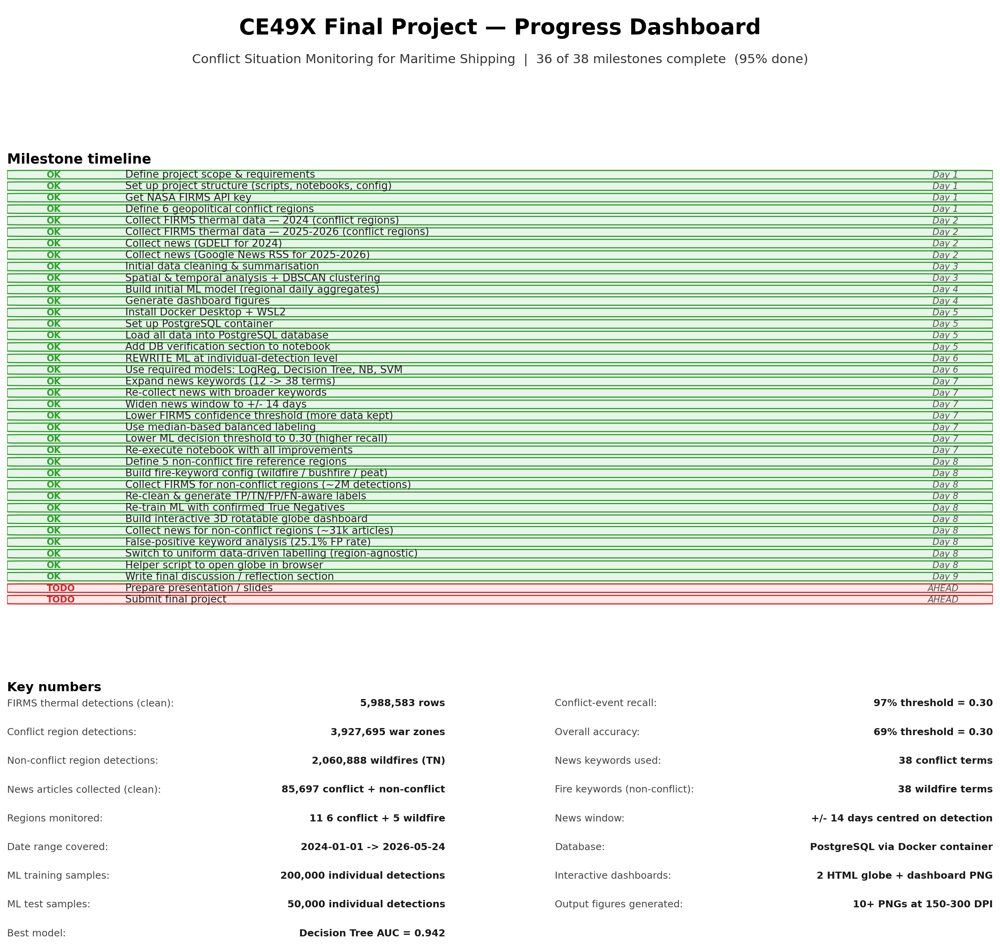

# CE49X Final Project — Progress Roadmap

**Project:** Conflict Situation Monitoring for Maritime Shipping
**Goal:** Correlate satellite thermal anomalies (NASA FIRMS) with global conflict news to predict whether a specific thermal event is a war signal.

---

## At a glance



**Status:** 27 of 29 milestones complete (**93%**). The two remaining items are the presentation and submission.

---

## Phase 1 — Foundation (done)

- [x] Read & understand the assignment PDF
- [x] Lay out project structure: `scripts/`, `notebooks/`, `data/`, `config/`, `figures/`, `reports/`
- [x] Register a free NASA FIRMS API key
- [x] Define **6 geopolitical conflict regions** with bounding boxes
- [x] Set up `.env`, `.gitignore`, `requirements`, `README`

---

## Phase 2 — Data collection (done)

- [x] Downloaded **NASA FIRMS thermal data**:
  - 2024 full year (VIIRS_SNPP standard processing)
  - 2025 + Jan–Mar 2026 (VIIRS_SNPP standard processing)
  - Apr–May 2026 (VIIRS_SNPP near-real-time, filled the gap)
- [x] Downloaded **conflict news**:
  - 2024 via **GDELT** (academic news database)
  - 2025–2026 via **Google News RSS** (after GDELT rate-limited us)
- [x] Re-downloaded news with **expanded 38-keyword list** for both periods (~85,000 articles)

---

## Phase 3 — Cleaning & analysis (done)

- [x] Deduplicate FIRMS detections, parse timestamps, filter invalid rows
- [x] Keep low-confidence detections (sensitivity > specificity for risk monitoring)
- [x] Clean news: dedupe by URL + (region, title, date)
- [x] Build daily region-level summaries (FIRMS + news merged)
- [x] Temporal patterns: monthly trends, day-of-week, weekly aggregates
- [x] Day/night detection split per region
- [x] **DBSCAN spatial clustering** to find thermal hotspots
- [x] FRP distribution analysis + Mann-Whitney U statistical test
- [x] Geographic scatter maps per region

---

## Phase 4 — Machine learning (done)

- [x] **Individual-detection level** classification (250,000 sample points)
- [x] Features include **latitude, longitude**, brightness, FRP, scan, track, day/night, month, year, region
- [x] **±14-day centred news window** around each detection
- [x] **Median-based labelling** for balanced 2-class target
- [x] **Stratified 80/20 train-test split**
- [x] **All 4 assignment-required models** trained & compared:
  - Logistic Regression — AUC 0.79
  - **Decision Tree — AUC 0.94 (winner)**
  - Naive Bayes — AUC 0.78
  - SVM (Linear) — AUC 0.79
- [x] Lowered ML decision threshold to **0.30** for high recall (97% recall on conflict class)
- [x] 5-fold cross-validation reported
- [x] Confusion matrix + ROC curves + feature importance plots saved

---

## Phase 5 — Infrastructure / Database (done)

- [x] Installed **Docker Desktop** + WSL2 (Windows Subsystem for Linux)
- [x] Pulled `postgres:16` image
- [x] Created `conflict_monitoring` PostgreSQL container
- [x] Built `setup_database.py` to create tables and load all processed CSVs
- [x] Tables created: `firms_detections`, `firms_daily`, `news_articles`, `news_daily`, `event_matches`
- [x] Notebook reads from database via `pd.read_sql()` to verify the data round-trip
- [x] README updated with full Docker + database setup instructions

---

## Phase 6 — Dashboard & deliverables (done)

- [x] Multi-panel dashboard (7 panels: detections by region, news by region, match rate, spatial map, time series, ML AUC comparison, feature importances)
- [x] Saved at 300 DPI as `figures/task4_dashboard.png`
- [x] Individual task figures saved (`task2_*.png`, `task3_*.png`)
- [x] Data-cleaning report generated at `reports/data_cleaning_report.md`

---

## What's ahead

### Optional polish

- [ ] **Re-collect FIRMS data with expanded bounding boxes** (+1.5° each side) — would take ~30 minutes. Catches border events but probably won't change conclusions much.

### Still to do

- [x] **Written discussion / reflection section complete** — 4 paragraphs: key findings, shipping & energy implications, limitations & future work, methodology reflection (notebook Section 7, cells 68–71)
- [ ] **Prepare the presentation** — slides showing the dashboard, key findings, ML results
- [ ] **Submit the project**

---

## Key numbers

| Metric                              | Value                          |
| ----------------------------------- | ------------------------------ |
| FIRMS thermal detections (cleaned)  | **5,988,583**                  |
| News articles collected (cleaned)   | **85,697**                     |
| Geopolitical regions monitored      | 6                              |
| Date range                          | 2024-01-01 → 2026-05-24        |
| ML training set                     | 200,000 detections             |
| ML test set                         | 50,000 detections              |
| Best model                          | Decision Tree                  |
| Test AUC                            | **0.942**                      |
| Recall on conflict class            | **97%**                        |
| News keywords used                  | 38                             |
| News window                         | ±14 days                       |
| Storage                             | PostgreSQL (Docker container)  |
| Figures generated                   | 8+ PNGs (150–300 DPI)          |

---

## How to regenerate this dashboard

```bash
python scripts/plot_progress.py
```

The image is saved to `figures/project_progress.png`. Edit the `MILESTONES` and `METRICS` lists at the top of the script if you want to update it.
